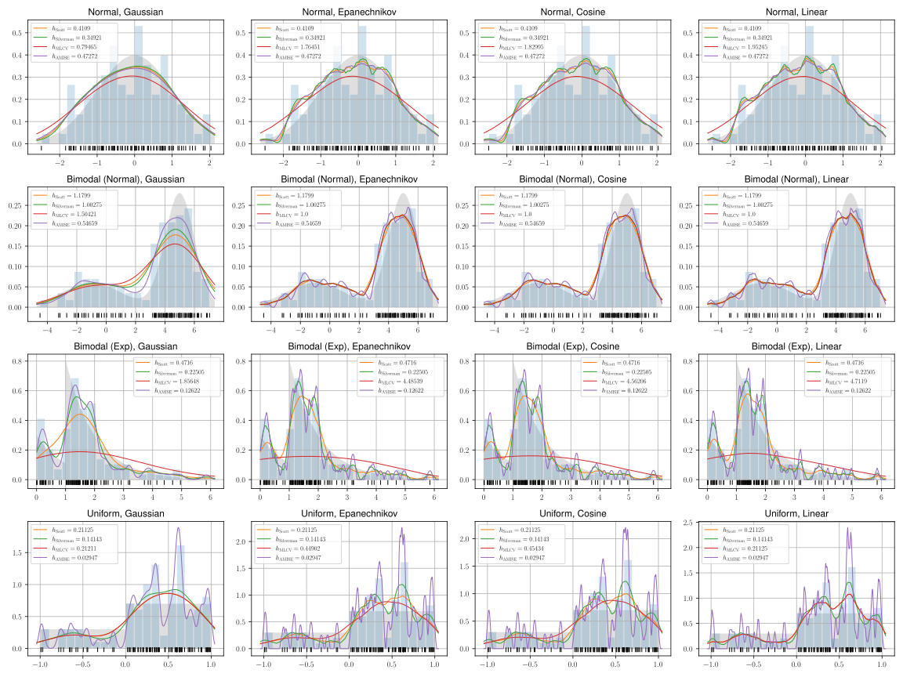

# KDEBandwidth

KDE Bandwidth selector implementation in Python.

### Content

This project includes a KDE implementation with numpy, scipy and the following four bandwidth selectors:

- Silverman's rule of thumb
- Scott's rule of thumb
- MLCV (Maximum Likelihood Cross-Validation)
- AMISE (Asymptotic Mean Integrated Squared Error)

The four estimators are tested on four KDE kernels (Gaussian, Epanechnikov, Cosine, Linear) and four distributions (Normal, Bimodal (Normal), Bimodal (Exponential), Uniform). The estimated bandwidth $h$ and corresponding error $MSE$ can be found at [statistics.csv](./statistics.csv).

### Reference

1. Scott, D.W. 1992. Multivariate density estimation: theory, practice, and visualization. John Wiley & Sons.
2. Silverman, B.W. 1986. Density Estimation for Statistics and Data Analysis. Chapman & Hall/CRC Monographs on Statistics and Applied Probability.
3. Wand, M.P. and Jones, M.C. 1994. Kernel smoothing. CRC press.

---

This is a course project for Advanced Engineering Mathematics, ECNU, 2022 Fall.